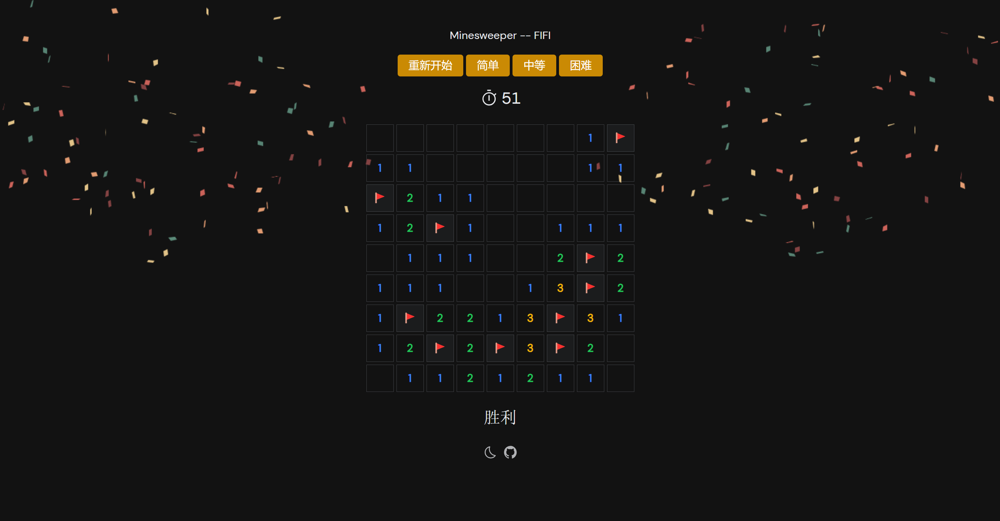

    

<h1 align="center">
💣 A Little Game - Minesweeper 💣
</h1>

    一个经典的扫雷游戏！

<a href="https://joyful-monstera-06e5b3.netlify.app"><b>开始游戏</b></a>

 
 

## 🕹️ 玩法

1. 点开所有不存在 💣 的方块格子则【胜利】
2. 踩到 💣 则【失败】
3. 鼠标左键单击点开格子
4. 点开的格子周围如果没有炸弹则会继续打开旁边的格子，直至周围存在 💣
5. 鼠标右键可以给格子标 🚩，表示该方格是找到的 💣
6. 双击可以打开周围除了标 🚩 的格子

## 📖 介绍
教程来源于【Anthony Fu】

## 🖼️ 展示

